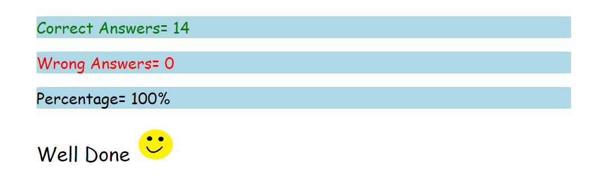

                                                               JavaScript
                                                               Assignment 1

# 1: Who is the founder of JavaScript and when?

Ans: BRENDAN EICH - 1995

# 2: What was the first browser, and when was it released?

Ans: World Wide Web - 1990

# 3: Name the two dominant browsers in 2000?

Ans: Net Scape Navigator
     Internet Explorer

# 4: What is ECMAScript? 

Ans: European Computer Manufactures Associsation

# 5: Define syntax?

Ans: A Set of rule that has to be follow when writting Code.

# 6: What is TC39?

Ans: TC39 is a group of JavaScript developers, implementers, academics, and more, collaborating with the community to maintain and evolve the definition of JavaScript.

# 7: Name different data types in JavaScript?

Ans: Primitive & Non-Primitive 

# 8: Explain primitive and non-primitive data types?

Ans: 1-Primitive

String-> A set of caharcters engludes in dobble and single cots
Number->Any numbers
Boolean->t/f
Undefined->Value is not assighned
Null->Intensional absents of value
BigInt->Too number

2.Non Primitive

Derived from primitive datatype
Let are="name",20,true
Let obj={Key:Value}
Array->Collaction datas includes in []saparated with comma
obj->Related datas includes in{} in the form of key value pairs saparated with comma

# 9: Differentiate null and undefined?

Ans:  undefined means a variable has been declared but has not yet been assigned a value, whereas null is an assignment value, meaning that a variable has been declared and given the value of null.

